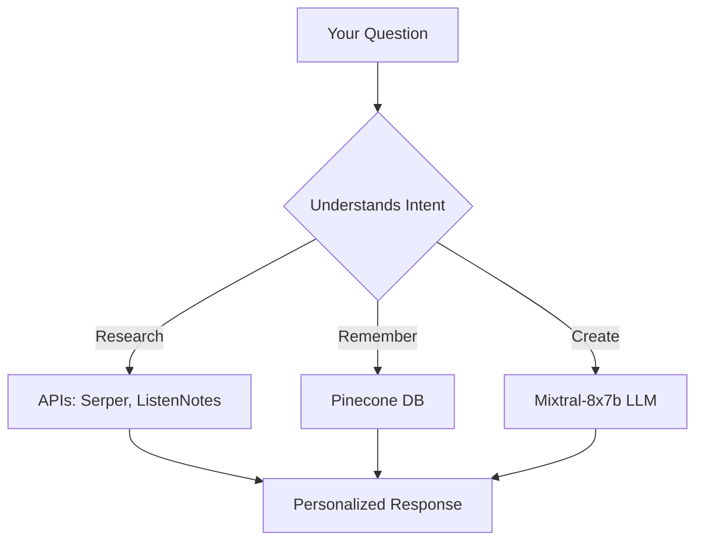

```markdown
# 🎙️ PodcastPro AI Assistant  

**Your smart co-host for podcast creation** ✨  

Ever wish you had a producer who remembers *everything* about your show? PodcastPro is an AI assistant that:  
- 🔍 Researches topics and finds guests  
- 📝 Generates episode outlines *in your style*  
- 💾 Remembers your preferences across conversations  
- 🚀 Saves you 5+ hours per episode  

**Try it now →**  
```bash
git clone https://github.com/MohammedThaher01/podcast-pro.git
cd podcast-pro
python chat_with_bot.py
```

---

## 🌟 Features  
| Feature               | What It Does                                  | Example Command                     |
|-----------------------|-----------------------------------------------|--------------------------------------|
| **Memory**           | Remembers your show’s theme/guests forever    | `Remember my podcast is "Tech Talks"`|
| **Smart Research**   | Pulls fresh data from 10+ sources             | `Find recent AI ethics articles`     |
| **Script Crafting**  | Generates SEO-optimized show notes            | `Write intro for quantum computing`  |

---

## 🛠️ Setup (1 Minute)  

1. **Get your free API keys**:  
   - [Groq](https://console.groq.com/keys) (for Mixtral AI)  
   - [Pinecone](https://app.pinecone.io/) (for memory)  
   - [Serper](https://serper.dev/) (for real-time search)  

2. **Configure**:  
   ```bash
   echo "GROQ_API_KEY=your_key_here" > .env
   echo "PINECONE_API_KEY=your_key_here" >> .env
   echo "SERPER_API_KEY=your_key_here" >> .env
   pip install -r requirements.txt
   ```

3. **Start chatting**:  
   ```bash
   python chat_with_bot.py
   ```
   > 💡 Pro Tip: Use commands like `#remember my target audience is developers` to teach the bot

---

## 💬 Live Demo  
```plaintext
You: suggest topics for my cybersecurity podcast  

PodcastPro: 🚨 Hot topics this week:  
1. "AI-Powered Cyber Attacks (2024 Trends)"  
2. "Interview: NSA Whistleblower on Gov't Surveillance"  
3. "How to Secure Your Smart Home"  

Need sources for any of these? [y/n]
```

---

## 🧠 Under the Hood  


---

## 🚀 What's Next?  
- [x] Core AI agent (Done!)  
- [x] Terminal interface (Done!)  
- [ ] Web interface (October 2024)  
- [ ] Auto-upload to YouTube (November 2024)  

**Found a bug?** [Report it here](https://github.com/MohammedThaher01/podcast-pro/issues)  

---

## 📜 License  
MIT © 2024 [Mohammed Thaher](https://github.com/MohammedThaher01) 
